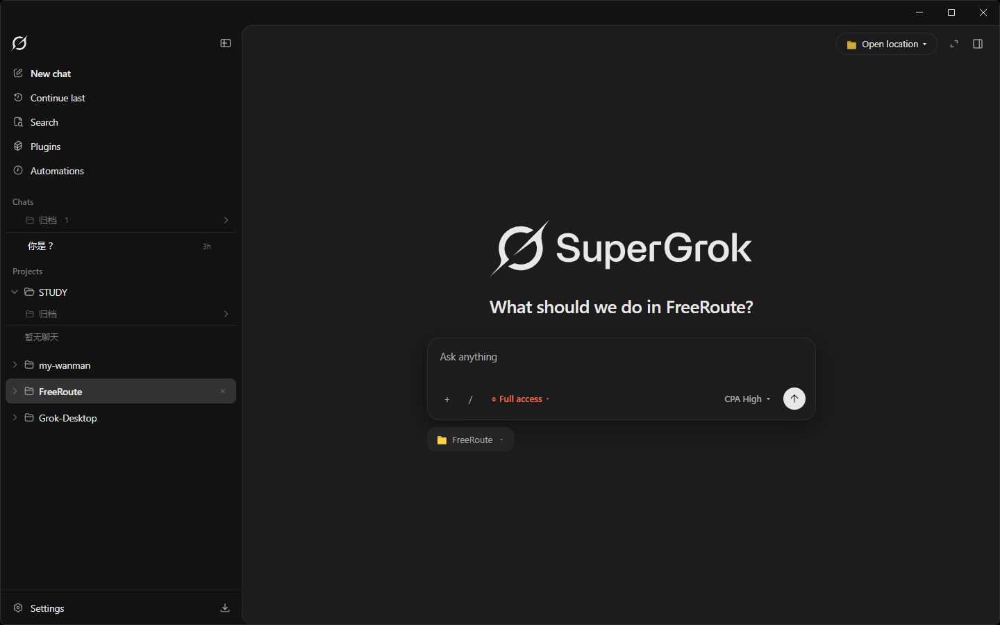
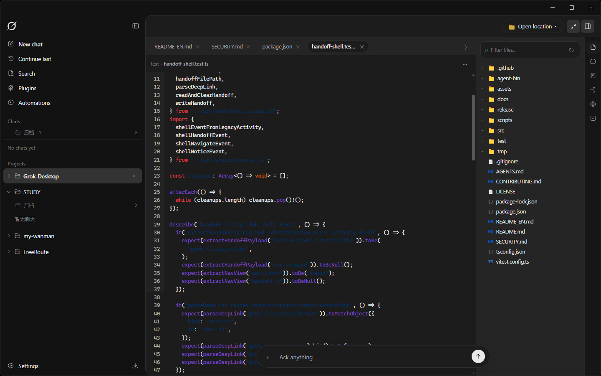
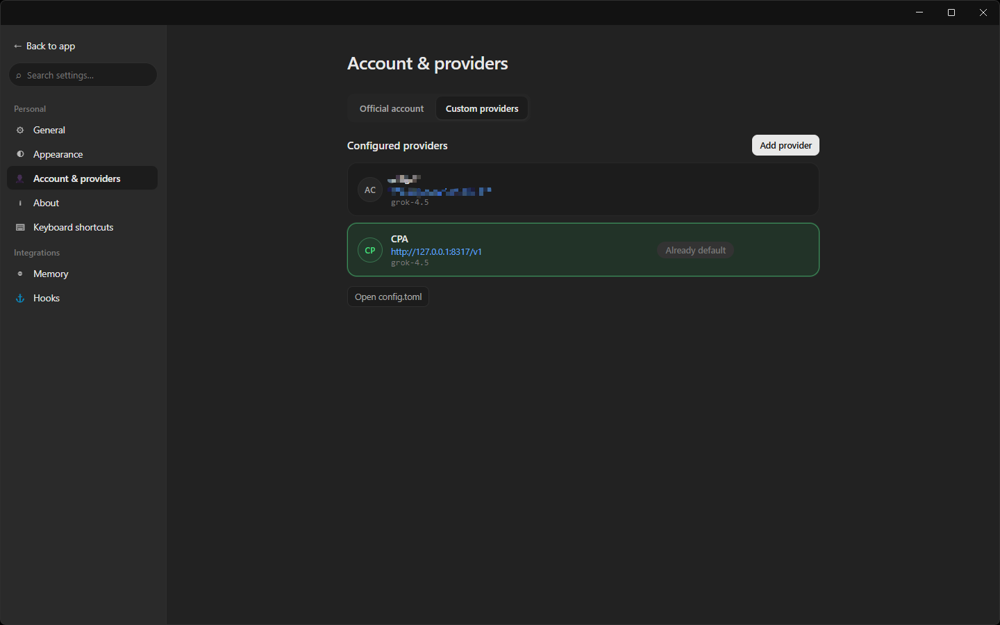
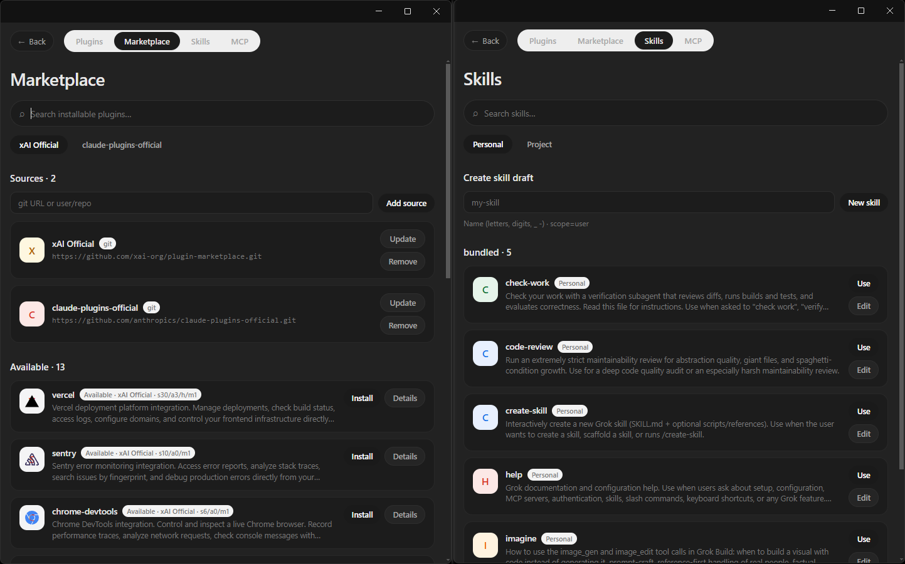

# Grok Desktop

  

  <strong>Desktop workbench for Grok Build</strong> 
  <b>Codex-aligned UX</b> · Official login & custom relays · Multi-project sessions

  <a href="./README_ZH.md">中文</a> ·
  <a href="https://github.com/fanghui-li/Grok-Desktop/releases">Download installer</a>

  
  
  
  

---

**Grok Desktop** puts the Grok agent in a GUI: layout and interaction align with OpenAI Codex Desktop; intelligence still runs in Grok. Built for people who install the package — no dev setup required.

## Install & get started

1. Open [Releases](https://github.com/fanghui-li/Grok-Desktop/releases) and download **`Grok Desktop-*-win-x64.exe`**
2. Install and launch
3. **Settings → Account & providers**  
   - **Official account**: sign in with xAI / Grok  
   - **Custom provider**: OpenAI-compatible relay (Base URL, API key, model, …)
4. Add or pick a project and start chatting  

Installers can bundle the agent so you can use the app right away. User data lives under **`~/.grok-desktop`**, separate from the CLI’s `~/.grok`.

## What you can do

- **Three-column workbench** — projects/sessions, chat, side panel (files & tools)
- **Permissions & models** — access modes, model / reasoning chips
- **Plan & Goal modes** — toggle chips near the composer; status always visible
- **Multi-project · multi-session** — sidebar, search, archive
- **Familiar input** — `@` files, attachments, `/` commands, skills
- **Custom relays** — multiple providers, set default, connectivity Ping, switch models in chat

### Custom providers (short)

| | |
|--|--|
| Fields | Name, Base URL, API key, protocol, model |
| UX | Fetch models; multiple providers; set default; switch via chat chip |
| Safety | **Isolated from official OAuth**; relay uses its own key; keys **not shown in clear text** |

## Language

**Settings → General → Language**: system / 简体中文 / English.  
Only the UI chrome (nav, settings, buttons, …) is translated — agent replies and tool logs are not.

## Troubleshooting

- Won’t start, sign-in fails, or relay is unreachable: check **Settings → Account & providers**; use **Ping** on custom providers for latency  
- Feedback or bugs: [Issues](https://github.com/fanghui-li/Grok-Desktop/issues) — include OS, installer version, and steps to reproduce  

## Help us maintain this

Still **0.1** — rough edges welcome.  
We track CLI parity in a **[CLI ↔ Desktop capability matrix](./docs/cli-desktop-capability-matrix.md)** (Chinese): what’s done, partial, or Desktop-only.

| How to help | |
|-------------|--|
| File issues | [Issues](https://github.com/fanghui-li/Grok-Desktop/issues) |
| Update the matrix | Stale rows → PR the table |
| Pick a gap | 🟡 / ❌ rows are backlog hints |
| Conventions | [Contributing](./CONTRIBUTING.md) · [Docs index](./docs/README.md) *(mostly Chinese)* |

Small PRs are great. No need to finish the whole matrix.

## UI screenshots

### Welcome

  

### Main workspace

  

### Custom providers

  

### Plugins

  

## Friendship Link

- [LinuxDo](https://linux.do)
---

[Apache-2.0](./LICENSE) · © 2026 [leofanghui](https://github.com/fanghui-li)
